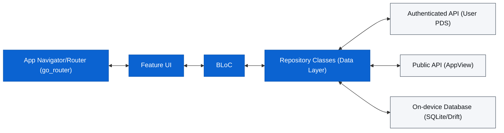

# Development Guide

- [Overview](#overview)
  - [Directory Structure](#directory-structure)
  - [Data Flow](#data-flow)
- [Quick Start](#quick-start)
- [Common Tasks](#common-tasks)
- [Website](#website)
- [Architecture](#architecture)
  - [Stack](#stack)
  - [Feature Module Layout](#feature-module-layout)
- [Database](#database)
  - [Drift (primary store)](#drift-primary-store)
    - [Adding a migration](#adding-a-migration)
  - [ObjectBox (vector store)](#objectbox-vector-store)
    - [Running unit tests (ObjectBox native library)](#running-unit-tests-objectbox-native-library)
- [Semantic Search](#semantic-search)
- [Liked Posts](#liked-posts)
- [Testing](#testing)
- [Code Generation](#code-generation)
- [Routes](#routes)
- [References](#references)

## Overview

- **Framework:** Flutter (M3)
- **State Management:** `flutter_bloc`
- **Database:** Drift (SQLite)
- **Networking:** Dio + `atproto`/`bluesky` packages
- **Navigation:** `go_router`
- **Data Serialization:** `freezed` + `json_serializable`

### Directory Structure

The project follows a feature-first architecture layered with a core module:

- `lib/core/`: Shared infrastructure, database, router, and themes.
- `lib/features/`: Feature-specific logic (Auth, Feed, Search, Profile, etc.).
  - `<feature>/bloc/`: Business logic components.
  - `<feature>/presentation/`: UI screens and widgets.
  - `<feature>/data/`: (Optional) Feature-specific repositories or models.

### Data Flow



## Quick Start

```sh
flutter pub get
just objectbox-setup # once per machine (macOS/Linux)
just gen
flutter run
```

## Common Tasks

Use `just` for common workflows:

| Command                | Description                                           |
| ---------------------- | ----------------------------------------------------- |
| `just format`          | Run `dart format`                                     |
| `just lint`            | Run `flutter analyze`                                 |
| `just objectbox-setup` | Install pinned ObjectBox native runtime (macOS/Linux) |
| `just objectbox-check` | Verify ObjectBox native runtime is present            |
| `just test`            | Run the full `flutter test` suite                     |
| `just gen`             | Run `build_runner` for code generation                |
| `just check`           | Format, lint, and test in sequence                    |

For release versioning, signing, packaging, and distribution, see the
[release documentation](docs/release.md).

## Website

The public website lives in `www` as an Astro project.

```sh
cd www
pnpm install
pnpm dev
pnpm build
```

Astro source files live under `www/src`:

- `/pages` defines routes.
- `/components` holds reusable page sections and layout components.
- `/content/legal` contains the legal pages as Markdown.
- `/styles/shared.css` is the shared stylesheet for the Astro site.

Static files that must keep exact public routes live in `www/public`, including:

- `.well-known/apple-app-site-association`
- `.well-known/assetlinks.json`
- `_headers`
- `client-metadata.json`
- favicon and image assets

The legal routes are `/privacy`, `/terms`, and `/csae-policy`.

## Architecture

### Stack

| Layer            | Technology                                                    |
| ---------------- | ------------------------------------------------------------- |
| Framework        | Flutter (Material 3)                                          |
| State management | `flutter_bloc` (Bloc + Cubit)                                 |
| Primary database | Drift (SQLite) — source of truth                              |
| Vector store     | ObjectBox — embeddings for semantic search                    |
| Networking       | `bluesky` / `atproto` packages + Dio                          |
| Navigation       | `go_router` (StatefulShellRoute)                              |
| Code generation  | `build_runner`, `freezed`, `drift_dev`, `objectbox_generator` |

### Feature Module Layout

Each feature follows this convention:

```sh
features/<feature>/
  bloc/       # Bloc or Cubit + State + Event classes
  cubit/      # Lighter-weight cubits where appropriate
  data/       # Repository classes; API + database interactions
  presentation/
    <feature>_screen.dart
    widgets/
```

## Database

### Drift (primary store)

Powered by **Drift** (SQLite). All migrations live in `lib/core/database/app_database.dart`.

Current schema version: **15**

| Table               | Version | Purpose                                                  |
| ------------------- | ------- | -------------------------------------------------------- |
| `accounts`          | 1       | Auth sessions (DID, tokens, handle, service URL)         |
| `cached_profiles`   | 2       | Profile metadata cache                                   |
| `cached_posts`      | 2       | Post content cache for offline display                   |
| `settings`          | 1       | Key-value application configuration                      |
| `saved_feeds`       | 3       | User's pinned and saved feeds                            |
| `cached_feed_pages` | 12      | First-page feed cache for cold-start UX                  |
| `search_history`    | 4       | Persistent local search query history                    |
| `drafts`            | 5       | Offline-first post drafts with media                     |
| `saved_posts`       | 6       | Locally saved posts (save type: local or cloud bookmark) |
| `labeler_cache`     | 9       | Cached labeler service policies                          |
| `liked_posts`       | 15      | Locally persisted liked posts for semantic search        |

#### Adding a migration

1. Add or modify table definition in `lib/core/database/tables.dart`.
2. Bump `schemaVersion` in `AppDatabase`.
3. Add `if (from < N) { ... }` block in `MigrationStrategy.onUpgrade`.
4. Run `just gen` to regenerate `app_database.g.dart`.

### ObjectBox (vector store)

ObjectBox runs as a secondary store alongside Drift. It holds only embedding vectors and
the metadata needed to join back to Drift.

The `EmbeddedPost` entity stores:

- `postUri` (unique AT-URI)
- `accountDid`
- `source` (`'saved'` or `'liked'`)
- `indexedText` — text used to produce the embedding
- `embedding` — 384-dimensional float32 vector (HNSW cosine index)
- `embeddedAt`

After modifying `EmbeddedPost`, run `just gen` to regenerate `objectbox.g.dart` and
`objectbox-model.json`.

#### Running unit tests (ObjectBox native library)

ObjectBox requires a platform native library to run `flutter test` locally.
Lazurite standardizes this setup through a pinned installer script.

Supported local platforms: macOS and Linux.

Run this once per machine:

```sh
just objectbox-setup
```

`just test` and `just test-quiet` intentionally run a preflight check
(`just objectbox-check`) and fail fast with setup instructions if the
runtime is missing.

## Semantic Search

On-device vector search over saved and liked posts using:

- **Model:** `all-MiniLM-L6-v2` quantized INT8 TFLite model (384D output, ~25 MB)
- **Tokenizer:** WordPiece, max 256 tokens, bundled as Flutter assets
- **Inference:** Long-lived background `Isolate` via `EmbeddingService`
- **Storage:** ObjectBox with HNSW cosine index on the embedding vector

The `EmbeddingService.isAvailable` flag gates all semantic search UI entry points. On
initialization failure the feature degrades gracefully to unavailable.

## Liked Posts

Liked posts are synced from the Bluesky API and persisted locally in the `liked_posts`
Drift table. This feeds the semantic search pipeline.

**`LikedPostsRepository`** (`lib/features/feed/data/liked_posts_repository.dart`):

| Method                                       | Description                                                                   |
| -------------------------------------------- | ----------------------------------------------------------------------------- |
| `syncLikes(accountDid)`                      | Paginate `getActorLikes` until a known URI is hit or 1000-post cap is reached |
|                                              | evicts oldest on overflow                                                     |
| `getLikedPosts(accountDid, {limit, offset})` | Paginated query ordered by `likedAt DESC`                                     |
| `removeLike(accountDid, postUri)`            | Delete a single entry                                                         |

## Testing

Run the full suite:

```sh
just test
# or with failure-only reporter (recommended for large suites):
just test-quiet
```

Coverage target: **>99%** (±5% acceptable). All new code must have tests. Widget tests
use `NativeDatabase.memory()` for Drift and mocktail for API mocks.

## Code Generation

Run after any change to:

- Drift table definitions (`tables.dart`)
- ObjectBox entities (`embedded_post.dart`)
- `freezed` models
- `json_serializable` classes

```sh
just gen
# or:
dart run build_runner build --delete-conflicting-outputs
```

## Routes

| Path        | Description                    |
| ----------- | ------------------------------ |
| `/login`    | Authentication gateway         |
| `/`         | Home feed tab                  |
| `/search`   | Search tab                     |
| `/profile`  | Current user profile tab       |
| `/settings` | Global settings                |
| `/compose`  | Root-level modal for new posts |

## References

- [Bluesky API Documentation](https://docs.bsky.app/)
- [AT Protocol Specification](https://atproto.com/)
- [Flutter Documentation](https://flutter.dev/docs)
- [Drift Documentation](https://drift.simonbinder.eu/)
- [ObjectBox Flutter](https://docs.objectbox.io/flutter)
