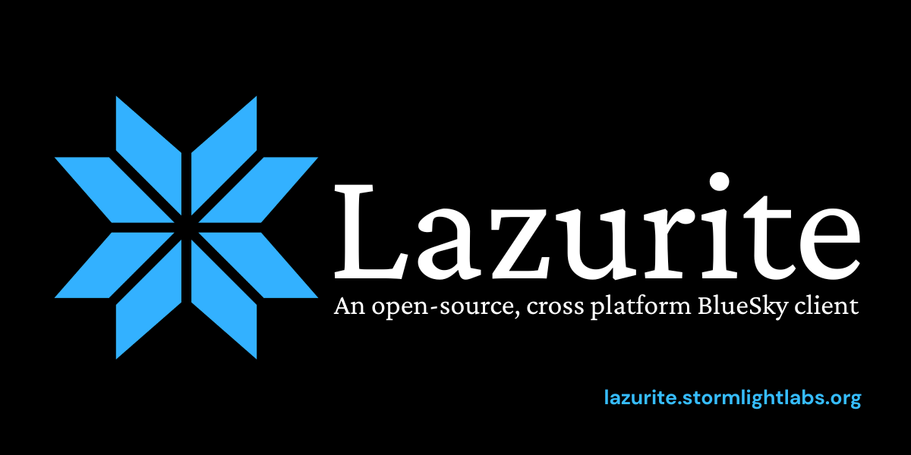
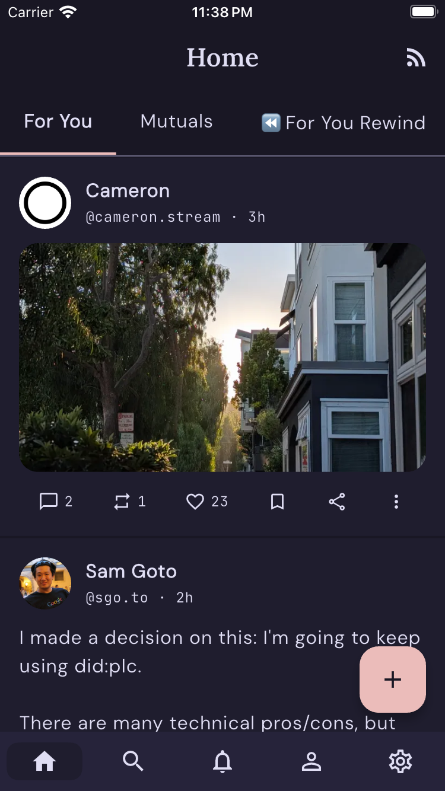
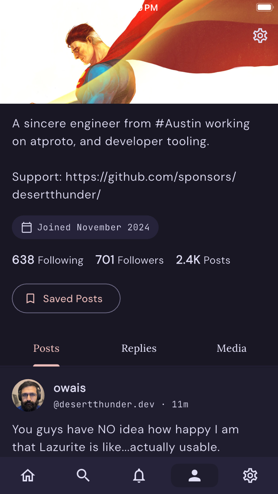
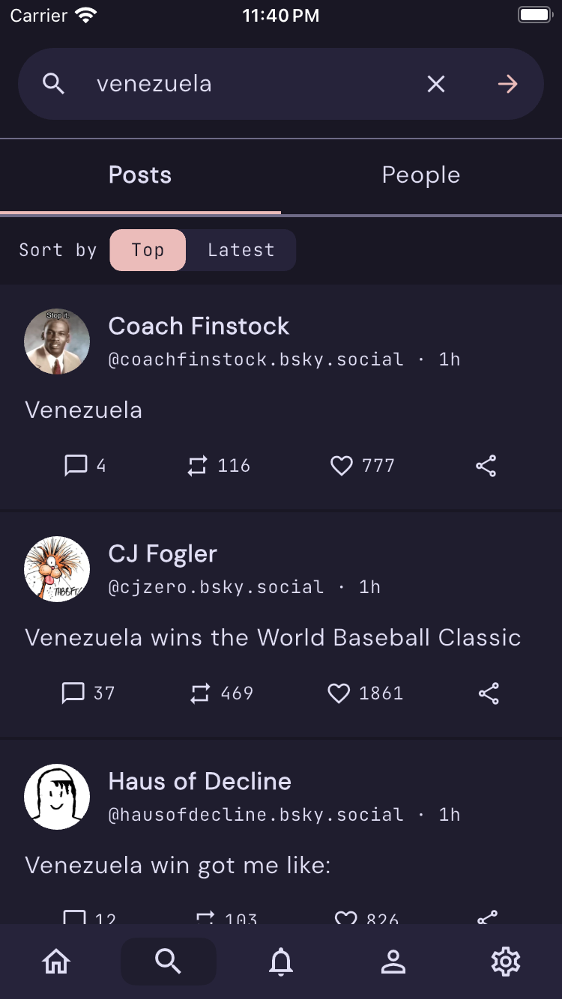
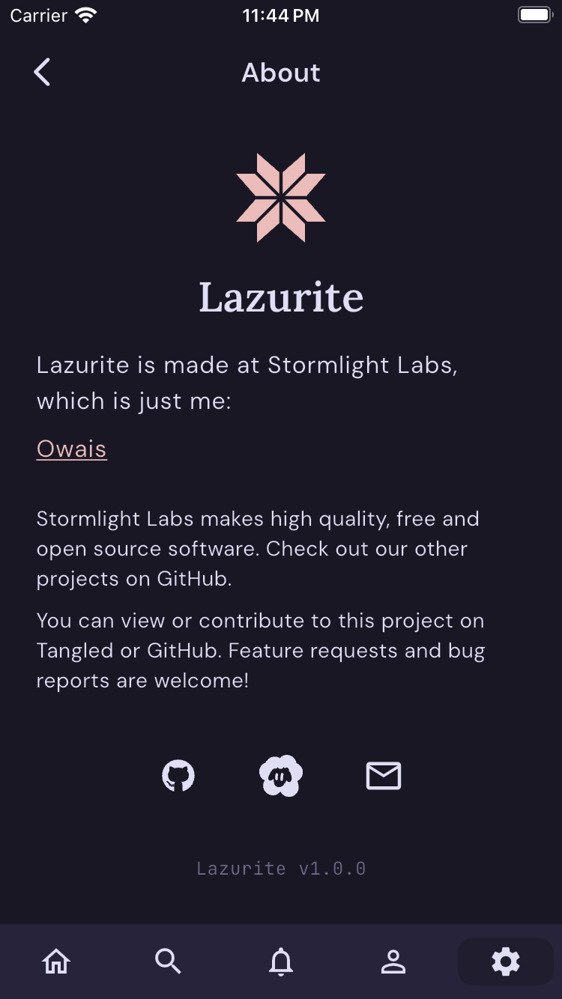
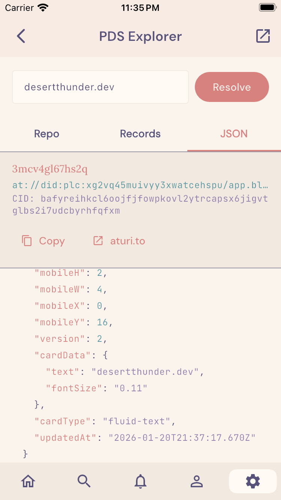

<!-- markdownlint-disable MD041 -->



Lazurite is a cross-platform Bluesky client built with Flutter and Dart using Material You (M3) design.

## Features

### Home Feed & Composer

| Home Feed                                                       | Composer                                                                                  | Profile                                                          |
| --------------------------------------------------------------- | ----------------------------------------------------------------------------------------- | ---------------------------------------------------------------- |
|                        |  |                             |
| View your personal timeline with support for threads and media. | Create new posts with rich text and media attachments. Supports replies and quoting.      | View detailed actor profiles, including their feed and metadata. |

### Search & Profile

| Search                                                | About                                | DevTools                                                                              |
| ----------------------------------------------------- | ------------------------------------ | ------------------------------------------------------------------------------------- |
|            |     |                                               |
| Discover people and posts across the Bluesky network. | About (showing Rose Pine Moon theme) | Built-in logs and developer utilities for exploring the AT Protocol (Rose Pine Dawn). |

### Offline Support & Drafts

Local-only drafts and caching powered by Drift (SQLite).

- **Drafts:** Save posts locally and publish later.
- **Search History:** Persisted local search history.
- **Saved Feeds:** Manage and pin your favorite feeds.

## Architecture

### Stack

- **Framework:** Flutter (M3)
- **State Management:** `flutter_bloc`
- **Database:** Drift (SQLite)
- **Networking:** Dio + `atproto`/`bluesky` packages
- **Navigation:** `go_router`
- **Data Serialization:** `freezed` + `json_serializable`

### Directory Structure

The project follows a feature-first architecture layered with a core module:

- `lib/core/`: Shared infrastructure, database, router, and themes.
- `lib/features/`: Feature-specific logic (Auth, Feed, Search, Profile, etc.).
  - `<feature>/bloc/`: Business logic components.
  - `<feature>/presentation/`: UI screens and widgets.
  - `<feature>/data/`: (Optional) Feature-specific repositories or models.

### Data Flow

- **Network:** Authenticated requests are routed through user PDS; public reads use the public AppView.
- **Database:** Drift manages local persistence for accounts, cached profiles/posts, settings, and drafts.

### Routing

Lazurite uses `StatefulShellRoute` for persistent bottom navigation.

| Path        | Description                    |
| ----------- | ------------------------------ |
| `/login`    | Authentication gateway         |
| `/`         | Home Feed tab                  |
| `/search`   | Search tab                     |
| `/profile`  | Current user profile tab       |
| `/settings` | Global settings                |
| `/compose`  | Root-level modal for new posts |

## Local Development

Use `just` for common tasks:

- `just format` - Runs `dart format`
- `just lint` - Proxies `flutter analyze`
- `just test` - Executes the `flutter test` suite
- `just gen` - Triggers `build_runner` for code generation
- `just check` - Runs format, lint, and tests in sequence

For a quick start:

```sh
flutter pub get
just gen
flutter run
```

### ObjectBox native library (unit tests)

To run unit tests locally, download the ObjectBox native library:

```sh
bash <(curl -s https://raw.githubusercontent.com/objectbox/objectbox-dart/main/install.sh)
```

This downloads `lib/libobjectbox.dylib` (or the equivalent for your platform). The file is gitignored and only needed to run `flutter test`; it is not required to build or run the app.

## Database Schema

Powered by **Drift**, the following tables are currently implemented:

| Table             | Purpose                                                          |
| ----------------- | ---------------------------------------------------------------- |
| `accounts`        | Local storage for session and auth tokens (DID, handle, service) |
| `cached_profiles` | Cached profile metadata to reduce network calls                  |
| `cached_posts`    | Cached post content for offline viewing                          |
| `saved_feeds`     | Locally Managed feed preferences                                 |
| `search_history`  | Persistent query history                                         |
| `drafts`          | Offline-first post drafting with media support                   |
| `settings`        | Key-value application configuration                              |

## References

- [Bluesky API Documentation](https://docs.bsky.app/)
- [AT Protocol Specification](https://atproto.com/)
- [Flutter Documentation](https://flutter.dev/docs)

## Credits

- Typography inspiration from [Anisota](https://anisota.net/) by [Dame.is](https://dame.is).
- Custom theming inspired by [Witchsky](https://witchsky.app/).
- DevTools (AT Protocol Explorer) inspiration from [pdsls](https://pds.ls/)
- AT URI links pass through [aturi.to](https://aturi.to/)
