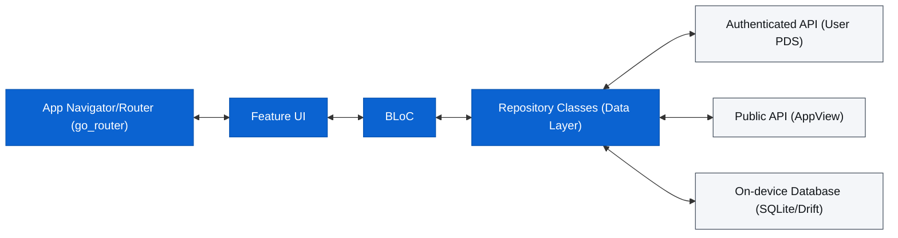

<!-- markdownlint-disable MD041 -->

# Lazurite

Lazurite is a cross-platform Bluesky & BlackSky client that *rocks*[^1] built with
Flutter and Dart using Material You (M3) design.

Download it on our [releases page](https://github.com/stormlightlabs/lazurite/releases/).

<!-- markdownlint-disable MD033 -->

## Features

### Core Bluesky & BlackSky Client

- Home timeline, custom feeds, feed pinning, and feed reordering.
- Post threads, replies, quote posts, reposts, likes, saves, and sharing.
- Rich post composition with facets, images, video uploads, replies, quotes, drafts, and scheduling.
- Profile screens with author feeds, likes, starter packs, lists, follows, followers, and profile actions.
- Search for posts, actors, hashtags, starter packs, and profile-scoped posts.
- Notifications, direct messages, lists, starter packs, labelers, and moderation preferences.
- In-app image viewer, video playback, media sharing, and media download support.

### Local And Offline Features

- Drift-backed local cache for the first page of feeds and profile data.
- Local drafts with account-scoped reply, quote, and media context.
- Local saved posts, liked-post sync, and search history.
- On-device semantic search for saved and liked posts using MiniLM embeddings and ObjectBox vector search.
- Offline-aware screens that render cached data and disable network-only actions when needed.

### Account And Protocol Tools

- OAuth login, account switching, session restore, and debug app-password login.
- Provider-aware AppView routing for Bluesky, Blacksky, and validated custom AppViews.
- Follow audit for deleted, deactivated, suspended, blocking, hidden, and self-follow records.
- Profile context powered by [Constellation](https://constellation.microcosm.blue) backlinks.
- AT Protocol Dev Tools for browsing PDS repositories, collections, and records as JSON.
- In-app logs with level filters, search, sharing, and export for debugging.

### Customization

- Five theme palettes: Lazurite™️[^2], Rose Pine, Catppuccin, Nord, and Oxocarbon.
- Light and dark variants built on Material 3.
- Card and Compact feed layouts.
- Configurable thread auto-collapse depth.

## Planned

### Reading And Media

- Gallery mode for browsing media-heavy feeds and post threads.
- Last-read position for resuming timelines.
- RSS feed export for public Bluesky profiles.

### Publishing

- Markdown rendering for post bodies.
- Auto-threading for long posts.

### Customization

- User-selectable serif, sans-serif, and monospace typefaces.
- Expanded layout controls for feed density and feed architecture.

### Protocol And Maintenance

- Social graph visualization.
- Firehose and Jetstream viewers inside Dev Tools.
- Expanded notification settings, permission flows, and remote push validation.

## Architecture

### Stack

- **Framework:** Flutter (M3)
- **State Management:** `flutter_bloc`
- **Database:** Drift (SQLite)
- **Networking:** Dio + `atproto`/`bluesky` packages
- **Navigation:** `go_router`
- **Data Serialization:** `freezed` + `json_serializable`

### Directory Structure

The project follows a feature-first architecture layered with a core module:

- `lib/core/`: Shared infrastructure, database, router, and themes.
- `lib/features/`: Feature-specific logic (Auth, Feed, Search, Profile, etc.).
  - `<feature>/bloc/`: Business logic components.
  - `<feature>/presentation/`: UI screens and widgets.
  - `<feature>/data/`: (Optional) Feature-specific repositories or models.

### Data Flow

For development setup, tooling, database schema, and contribution notes, see [DEVELOPMENT.md](DEVELOPMENT.md).
If you run tests locally on macOS or Linux, run `just objectbox-setup` once
to install the pinned ObjectBox native runtime.

## References

- [Bluesky API Documentation](https://docs.bsky.app/)
- [AT Protocol Specification](https://atproto.com/)
- [Flutter Documentation](https://flutter.dev/docs)

## Credits

- Typography inspiration from [Anisota](https://anisota.net/) by [Dame.is](https://dame.is).
- Custom theming inspired by [Witchsky](https://witchsky.app/).
- DevTools (AT Protocol Explorer) inspiration from [pdsls](https://pds.ls/)
- AT URI links pass through [aturi.to](https://aturi.to/)

[^1]: It's actually a mineral <https://en.wikipedia.org/wiki/Lazurite>
[^2]: not really trademarked, actually a cool theme that you can find in the [desktop flavor](https://github.com/stormlightlabs/lazurite-desktop) too.
