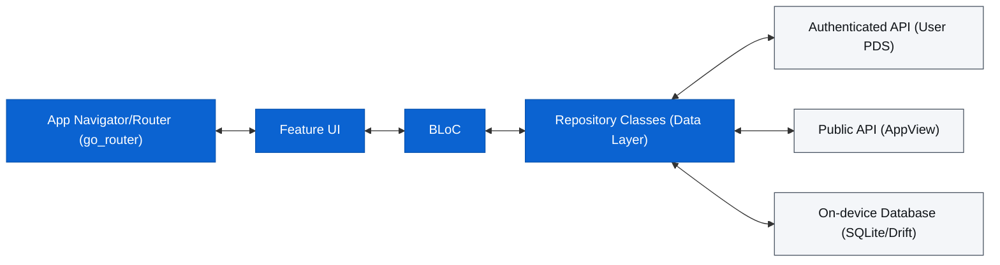

<!-- markdownlint-disable MD041 -->

Lazurite is a cross-platform Bluesky client that *rocks*[^1] built with Flutter and Dart using Material You (M3) design.

Download it on our [releases page](https://github.com/stormlightlabs/lazurite/releases/).

<!-- markdownlint-disable MD033 -->

## Features

### Home Feed & Composer

| Home Feed                                                       | Composer                                                                                  | Profile                                                          |
| --------------------------------------------------------------- | ----------------------------------------------------------------------------------------- | ---------------------------------------------------------------- |
|                        |  |                             |
| View your personal timeline with support for threads and media. | Create new posts with rich text and media attachments. Supports replies and quoting.      | View detailed actor profiles, including their feed and metadata. |

### Search & Profile

| Search                                                | About                                | DevTools                                                                              |
| ----------------------------------------------------- | ------------------------------------ | ------------------------------------------------------------------------------------- |
|            |     |                                               |
| Discover people and posts across the Bluesky network. | About (showing Rose Pine Moon theme) | Built-in logs and developer utilities for exploring the AT Protocol (Rose Pine Dawn). |

### Offline Support & Drafts

Local-only drafts and caching powered by Drift (SQLite).

- **Drafts:** Save posts locally and publish later.
- **Search History:** Persisted local search history.
- **Saved Feeds:** Manage and pin your favorite feeds.

## What Lazurite Offers Beyond Bluesky

### Available Now

- **Semantic Search:** On-device vector embeddings (all-MiniLM-L6-v2) let you search saved
  and liked posts by meaning, not just keywords.
- **Post Scheduling:** Write posts now, publish them later.
- **Follow Audit:** Bulk-analyze your follows to find deleted, deactivated, suspended, or
  blocking accounts. Batch unfollow in one tap like [clean follows](https://cleanfollow-bsky.pages.dev/)
- **Constellation Integration:** See who has blocked you and which lists you appear on,
  powered by [Constellation](https://constellation.microcosm.blue) backlinks.
- **AT Protocol Dev Tools:** Browse any user's PDS repository, inspect collections and
  individual records as JSON, like an in-app [pds.ls](https://pds.ls/).
- **Rich Theming:** Five full palettes (Lazurite™️[^2], Rose Pine, Catppuccin, Nord, Oxocarbon),
  each with light and dark variants, built on Material 3.
- **Offline First:** First page of feeds is cached locally; drafts, search history, and saved
  posts persist in an on-device database.
- **Local Drafts:** Auto-saved to the database, surviving crashes and force-closes. Multiple
  drafts per account with full reply/quote/media context.
- **Layout Options:** Toggle between Card and Compact feed views. Configure thread
  auto-collapse depth (off, 1–6 levels).
- **In-App Logs:** Filter by level, full-text search, share or export, useful for
  debugging and AT Protocol development.

### On the Roadmap

- **RSS Feed Export:** View and export any public Bluesky profile as an RSS feed.
- **Custom Fonts:** User-selectable serif, sans-serif, and monospace typefaces across the
  entire app.
- **Markdown Posts:** Toggleable Markdown rendering in post bodies.
- **Firehose & Jetstream Viewers:** Live AT Protocol event streams inside Dev Tools.
- **Auto-Threading:** Automatically split long posts into threaded replies.
- **Last Read Position:** Resume your timeline exactly where you left off.

## Architecture

### Stack

- **Framework:** Flutter (M3)
- **State Management:** `flutter_bloc`
- **Database:** Drift (SQLite)
- **Networking:** Dio + `atproto`/`bluesky` packages
- **Navigation:** `go_router`
- **Data Serialization:** `freezed` + `json_serializable`

### Directory Structure

The project follows a feature-first architecture layered with a core module:

- `lib/core/`: Shared infrastructure, database, router, and themes.
- `lib/features/`: Feature-specific logic (Auth, Feed, Search, Profile, etc.).
  - `<feature>/bloc/`: Business logic components.
  - `<feature>/presentation/`: UI screens and widgets.
  - `<feature>/data/`: (Optional) Feature-specific repositories or models.

### Data Flow

For development setup, tooling, database schema, and contribution notes, see [DEVELOPMENT.md](DEVELOPMENT.md).
If you run tests locally on macOS or Linux, run `just objectbox-setup` once
to install the pinned ObjectBox native runtime.

## References

- [Bluesky API Documentation](https://docs.bsky.app/)
- [AT Protocol Specification](https://atproto.com/)
- [Flutter Documentation](https://flutter.dev/docs)

## Credits

- Typography inspiration from [Anisota](https://anisota.net/) by [Dame.is](https://dame.is).
- Custom theming inspired by [Witchsky](https://witchsky.app/).
- DevTools (AT Protocol Explorer) inspiration from [pdsls](https://pds.ls/)
- AT URI links pass through [aturi.to](https://aturi.to/)

[^1]: It's actually a mineral <https://en.wikipedia.org/wiki/Lazurite>
[^2]: not really trademarked, actually a cool theme that you can find in the [desktop flavor](https://github.com/stormlightlabs/lazurite-desktop) too.
