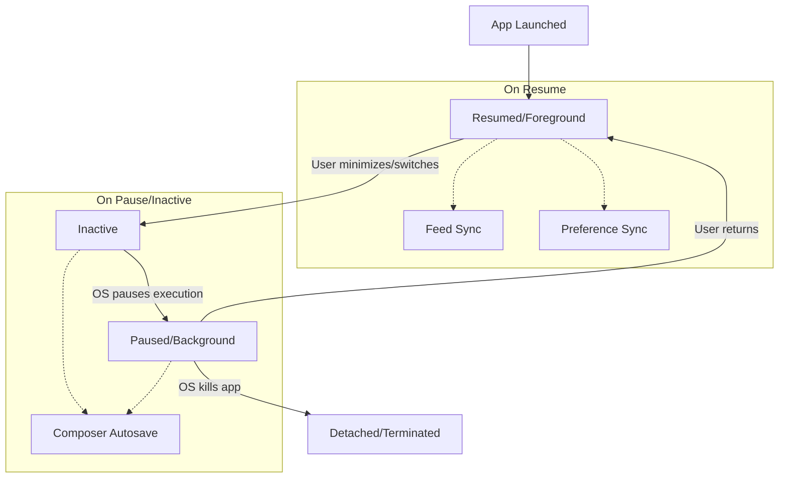

# Lazurite Architecture

## Core Principles

### Separation of Concerns

- UI layer (presentation) vs Data layer (infrastructure), with clear boundaries
- Feature-first organization inside those layers
  (each feature owns its domain/data/presentation)
- Reactive data flow using Riverpod providers and Drift streams

### ATProto Best Practices

- Cursor-based pagination everywhere (avoid OFFSET paging for feeds)
- DID + at:// URIs internally; handles are user-facing only
- Service proxying via `atproto-proxy` header for DMs and specialized services

### Data Persistence

- Drift for relational data with reactive queries
- Secure storage (flutter_secure_storage) for tokens/keys, never in Drift
- Offline-first with optimistic updates and sync queues

### Multi-Account Data Isolation

All user-scoped data is keyed by `ownerDid` to prevent data bleeding between accounts:

**Scoped Tables:**

- `SavedFeeds` - User's saved feed generators
- `FeedContentItems` - Cached posts from feeds
- `FeedCursors` - Pagination cursors per feed
- `Notifications` - User notifications
- `BlueskyPreferences` - Content moderation settings
- `DmConvos` / `DmMessages` - Direct message conversations

**Implementation Pattern:**

DAOs accept `ownerDid` as a required parameter and filter all queries by it.

```dart
Stream<List<T>> watchData(String ownerDid) =>
  (select(table)..where((t) => t.ownerDid.equals(ownerDid))).watch();
```

Notifiers resolve `ownerDid` from the current auth state, defaulting to `'anonymous'`
for unauthenticated users viewing public content (e.g., Discover feed).

```dart
final ownerDid = (authState is AuthStateAuthenticated)
    ? authState.session.did
    : 'anonymous';
```

**Logout Behavior:**
User data is NOT wiped on logout. Instead, `ownerDid` filtering ensures the next
logged-in user only sees their own data. This allows fast account switching while
maintaining isolation.

## Feed Architecture

The feed system manages both feed metadata and content through two coordinated
repositories.

### Feed Metadata (`FeedRepository`)

**Purpose:** Manages information about feed generators (algorithms/sources).

**Location:** `lib/src/features/feeds/infrastructure/feed_repository.dart`

**Responsibilities:**

- Syncing saved feeds from user preferences (`app.bsky.actor.getPreferences`)
- Caching feed metadata (displayName, avatar, creator, likeCount)
- Managing pinned feeds for the feed selector UI
- Discovering trending feeds
- Handling offline-first optimistic updates with preference sync queue

**Data Model:** `SavedFeeds` table

- uri, displayName, description, avatar, creatorDid, likeCount, sortOrder, isPinned,
  lastSynced

**Feed URI Constants:**

- `kHomeFeedUri = 'home'` - Following feed
- `kDiscoverFeedUri` - Discover feed generator URI
- `kForYouFeedUri` - For You feed generator URI

### Feed Content (`FeedContentRepository`)

**Purpose:** Manages cached post content from feeds.

**Location:** `lib/src/features/feeds/infrastructure/feed_content_repository.dart`

**Responsibilities:**

- Fetching feed content (`app.bsky.feed.getTimeline`, `app.bsky.feed.getFeed`)
- Caching posts, profiles, and feed content items
- Managing cursors for pagination
- Providing reactive streams for UI updates

**Data Models:**

- `Posts` table - post content and engagement metrics
- `Profiles` table - author profile data
- `FeedContentItems` table - feed-to-post relationships with sortKey and reason
  (repost info)
- `FeedCursors` table - pagination cursors per feed

**Data Flow:**

```text
FeedContentRepository.fetchAndCacheFeed()
  ↓
FeedContentDao.insertFeedContentBatch()
  ↓
Drift: Posts + Profiles + FeedContentItems
  ↓
FeedContentDao.watchFeedContent() → Stream<List<FeedPost>>
  ↓
FeedContentNotifier → UI
```

### FeedPost Data Structure

Simplified view combining data from multiple tables:

```dart
class FeedPost {
  final Post post;           // Post content
  final Profile author;      // Author profile
  final String? reason;      // Feed-specific metadata (e.g., repost info)
}
```

The `reason` field contains JSON describing why the post appears in the feed
(e.g., "Reposted by @user").

## Network Architecture

### Host Routing

**Two Dio instances:**

- `dioPublic` - baseUrl: `https://public.api.bsky.app` (unauthenticated calls)
- `dioPds` - baseUrl: user's PDS URL (authenticated calls with automatic proxying)

**Endpoint Registry:**
Never "guess" where to send a call at runtime; encode routing in an endpoint map.

**Read-After-Write:**
PDS can patch AppView reads for consistency after writes.

### Service Proxying (DMs)

Chat requests use the `atproto-proxy` header:

- Header: `atproto-proxy: did:web:api.bsky.chat#bsky_chat`
- Requests go to user's PDS and are proxied to the chat service
- Must use PDS proxy; direct calls to public.api.bsky.app will fail

## Authentication

### OAuth Implementation

**Requirements:**

- DPoP (Demonstrating Proof-of-Possession)
- PAR (Pushed Authorization Request) in initial auth request
- Loopback server for callback handling

### Token Refresh Strategy

1. Reactive Refresh (401): When a request returns 401 Unauthorized, attempt token
   refresh and retry
2. Proactive Refresh: When token is within 5 minutes of expiration, refresh before
   the request
3. Session Invalidation (400): When server returns `InvalidToken` or `ExpiredToken`,
   clear session entirely

**Token Lifecycle:**

```text
[Created] ──────────> [Near Expiration] ──────> [Expired]
                      (5 min before)
    ↓                      ↓                        ↓
  Normal              Proactive                401 Retry
  Requests            Refresh                  or Invalidate
```

## Cache Management

### Cache Invalidation Triggers

1. Session Logout: Clears session storage, sets AuthState.unauthenticated
2. Session Invalidation (InvalidToken): Clears all cached content + logout
3. Stale Feed Cleanup: `FeedContentCleanupController` removes items not updated in 7
   days

## Application Lifecycle

Managed via `AppLifecycle` provider and direct `WidgetsBindingObserver` where critical
responsiveness is needed (e.g., autosave).

### Lifecycle State Flow



### Implementation Strategy

1. **Global Observers**: `AppLifecycle` provider (Riverpod) for reactive state
  management.
    - **Feed Sync**: `FeedSyncController` listens for `AppLifecycleState.resumed` to
    trigger `feedRepository.syncOnResume()`, ensuring content is fresh when the user
    returns.
    - **Preference Sync**: `PreferenceSyncController` fetches remote preferences and
    processes the background sync queue on `resumed`.
2. **Feature-Specific Implementation**:
    - **Composer Autosave**: Uses `WidgetsBindingObserver` directly in `ComposerScreen`
    state to trigger `forceSave` immediately on `paused` or `inactive` signals.
    This bypasses the slight delay of provider updates to ensure drafts are saved before
    the OS can kill the process.

## Feature Implementation Patterns

### Draft Publishing Pipeline

1. If draft has media files not yet uploaded → `uploadBlob()`
2. Construct `app.bsky.feed.post` record with blob references
3. `createRecord(collection: app.bsky.feed.post)`
4. On success: mark draft as published (or delete)

**Important:** Blobs are "temporary" until referenced by a record
(time window constraint).

### Smart Folders (Future)

**MVP Rule Types:**

- Author allow/deny (DID list)
- Keyword include/exclude (post text)
- Has media / has link
- Replies only / exclude replies
- Bookmarked only
- "Unread only" (local read-state)

**Execution Strategy:**

- Start non-materialized: `SELECT posts WHERE <rules> ORDER BY indexedAt DESC`
- Upgrade to materialized if needed: On cache insert, evaluate rules and populate folder
  items

## Testing Strategy

- Unit tests for business logic
- Widget tests for UI components
- Integration tests for repository/DAO interactions
- Target: >95% code coverage

## References

- [Read-After-Write](https://docs.bsky.app/docs/advanced-guides/read-after-write)
- [Handle Resolution](https://atproto.com/specs/handle)
- [XRPC Specification](https://atproto.com/specs/xrpc)
- [Bluesky HTTP Reference](https://docs.bsky.app/docs/category/http-reference)
- [Chat Service Issue #2775](https://github.com/bluesky-social/atproto/issues/2775)
